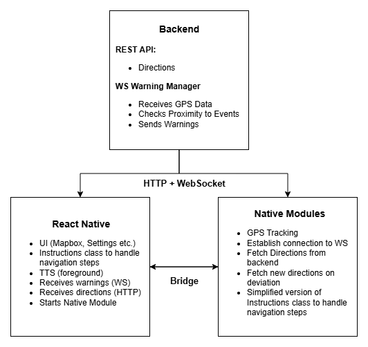

# Uway Backend

Express.js backend service for the [Uway app](https://github.com/Fuggel/Uway) providing REST API endpoints for location services, real-time traffic data, and WebSocket communication for live warnings.

## Architecture



## Features

-   **JWT Authentication**: RevenueCat subscription validation and token generation
-   **Location Services**: Speed cameras, speed limits, and traffic incidents
-   **Search Integration**: Mapbox-powered location search and suggestions
-   **Gas Station Data**: Real-time fuel prices and station information
-   **Route Optimization**: Turn-by-turn directions with customizable exclusions
-   **Real-time Warnings**: WebSocket-based incident and speed camera alerts
-   **Rate Limiting**: API protection and usage control

## Tech Stack

-   **Express.js** with TypeScript
-   **Socket.IO** for WebSocket communication
-   **JWT** for authentication
-   **Turf.js** for geospatial calculations

## Quick Setup

```bash
# Install dependencies
npm install

# Copy environment template and adjust as needed
cp .env.example .env

# Start development server
npm run dev
```

## Development Commands

| Command         | Description              |
| --------------- | ------------------------ |
| `npm install`   | Install dependencies     |
| `npm run dev`   | Start development server |
| `npm run build` | Build TypeScript         |
| `npm start`     | Start production server  |

## API Endpoints

**Authentication**: All endpoints except `/get-token` require JWT authentication via `Authorization: Bearer <token>` header.

### Get JWT

Generates a JWT after verifying the user's subscription status via RevenueCat.

-   **Method**: `GET`
-   **URL**: `http://localhost:8001/api/get-token?rcUserId=rcUserId`
-   **Parameters**:
    -   `rcUserId`: The RevenueCat user ID to validate subscription status.
-   **Example Response**:
    ```json
    {
        "token": "eyJhbGciOiJIUzI1NiIsInR5cCI6IkpXVCJ9...",
        "expiresIn": "2024-10-20T15:30:00.000Z"
    }
    ```

### Get Speed Cameras

Retrieve speed camera locations based on the provided coordinates.

-   **Method**: `GET`
-   **URL**: `http://localhost:8001/api/speed-cameras?lon=lon&lat=lat`
-   **Headers**: `Authorization: Bearer <token>`
-   **Parameters**:
    -   `lon`: Longitude of the user's location.
    -   `lat`: Latitude of the user's location.
-   **Example Response**:
    ```json
    {
        "data": {
            "type": "FeatureCollection",
            "features": [
                {
                    "type": "Feature",
                    "geometry": {
                        "type": "Point",
                        "coordinates": [9.9381394, 53.5815948]
                    },
                    "properties": {
                        "id": "12345",
                        "maxspeed": "50"
                    }
                }
            ]
        }
    }
    ```

### Get Speed Limits

Retrieve the closest speed limit based on the provided coordinates.

-   **Method**: `GET`
-   **URL**: `http://localhost:8001/api/speed-limits?lon=lon&lat=lat`
-   **Headers**: `Authorization: Bearer <token>`
-   **Parameters**:
    -   `lon`: Longitude of the user's location.
    -   `lat`: Latitude of the user's location.
-   **Example Response**:
    ```json
    {
        "data": {
            "distance": 15.5,
            "maxspeed": "50"
        }
    }
    ```

### Get Search Suggestions

Retrieve location search suggestions based on user input.

-   **Method**: `GET`
-   **URL**: `http://localhost:8001/api/search-suggestions?query=QUERY&sessionToken=TOKEN&lon=lon&lat=lat`
-   **Headers**: `Authorization: Bearer <token>`
-   **Parameters**:
    -   `query`: The search query string.
    -   `sessionToken`: A unique session token for the request.
    -   `lon`: Longitude of the user's location.
    -   `lat`: Latitude of the user's location.
-   **Example Response**:
    ```json
    {
        "data": [
            {
                "mapbox_id": "dXJuOm1ieHBsYzpBZ...",
                "name": "Hamburg Hauptbahnhof",
                "place_formatted": "Hamburg, Germany"
            }
        ]
    }
    ```

### Get Search Locations

Retrieve detailed location information based on a Mapbox ID.

-   **Method**: `GET`
-   **URL**: `http://localhost:8001/api/search-locations?mapboxId=ID&sessionToken=TOKEN`
-   **Headers**: `Authorization: Bearer <token>`
-   **Parameters**:
    -   `mapboxId`: The Mapbox ID of the location.
    -   `sessionToken`: A unique session token for the request.
-   **Example Response**:
    ```json
    {
        "data": {
            "type": "Feature",
            "geometry": {
                "type": "Point",
                "coordinates": [9.9936818, 53.5510846]
            },
            "properties": {
                "name": "Hamburg Hauptbahnhof",
                "place_formatted": "Hamburg, Germany"
            }
        }
    }
    ```

### Get Incidents

Retrieve real-time traffic incidents based on the provided coordinates.

-   **Method**: `GET`
-   **URL**: `http://localhost:8001/api/incidents?lon=lon&lat=lat`
-   **Headers**: `Authorization: Bearer <token>`
-   **Parameters**:
    -   `lon`: Longitude of the user's location.
    -   `lat`: Latitude of the user's location.
-   **Example Response**:
    ```json
    {
        "data": {
            "type": "FeatureCollection",
            "features": [
                {
                    "type": "Feature",
                    "geometry": {
                        "type": "Point",
                        "coordinates": [9.9381394, 53.5815948]
                    },
                    "properties": {
                        "type": 0,
                        "probabilityOfOccurrence": "certain",
                        "description": "Traffic accident"
                    }
                }
            ]
        }
    }
    ```

### Get Gas Stations

Retrieve nearby gas stations based on the provided coordinates.

-   **Method**: `GET`
-   **URL**: `http://localhost:8001/api/gas-stations?lon=lon&lat=lat`
-   **Headers**: `Authorization: Bearer <token>`
-   **Parameters**:
    -   `lon`: Longitude of the user's location.
    -   `lat`: Latitude of the user's location.
-   **Example Response**:
    ```json
    {
        "data": {
            "type": "FeatureCollection",
            "features": [
                {
                    "type": "Feature",
                    "geometry": {
                        "type": "Point",
                        "coordinates": [9.9381394, 53.5815948]
                    },
                    "properties": {
                        "name": "Shell",
                        "diesel": "1.45",
                        "e5": "1.65",
                        "e10": "1.62",
                        "iconType": "gas-station-cheap"
                    }
                }
            ]
        }
    }
    ```

### Get Directions

Retrieve route directions based on the provided start and destination coordinates.

-   **Method**: `GET`
-   **URL**: `http://localhost:8001/api/directions?profile=profileType&startCoordinates=lon,lat&destinationCoordinates=lon,lat&excludeTypes=type`
-   **Headers**: `Authorization: Bearer <token>`
-   **Parameters**:
    -   `profile`: The type of routing profile (e.g., `driving`, `walking`, `cycling`).
    -   `startCoordinates`: Longitude and latitude of the starting point.
    -   `destinationCoordinates`: Longitude and latitude of the destination.
    -   `excludeTypes` (optional): Road types to exclude from routing (e.g., `toll`, `highway`).
-   **Example Response**:
    ```json
    {
        "data": {
            "routes": [
                {
                    "geometry": "simplified_linestring_coordinates",
                    "distance": 15420.5,
                    "duration": 1240.2,
                    "legs": [
                        {
                            "summary": "Route summary",
                            "distance": 15420.5,
                            "duration": 1240.2,
                            "steps": [
                                {
                                    "voiceInstructions": [],
                                    "bannerInstructions": [],
                                    "maneuver": {
                                        "type": "turn",
                                        "modifier": "right"
                                    },
                                    "distance": 250.0,
                                    "duration": 30.5,
                                    "geometry": "step_geometry"
                                }
                            ]
                        }
                    ]
                }
            ]
        }
    }
    ```

## WebSocket

### Warning Manager

Enables real-time alerts for incidents and speed cameras based on the user's live location.

#### Emit: `user-location`

Send periodically (e.g., every 2 seconds) while navigation is active.

-   **Payload**:

    ```ts
    {
        eventType: "incident" | "speed-camera";
        lon: number;
        lat: number;
        heading: number;
        speed: number;
        userId: string;
        eventWarningType: string | null;
    }
    ```

-   **Example**:

    ```ts
    {
        eventType: "speed-camera",
        lon: 13.405,
        lat: 52.52,
        heading: 170,
        speed: 65,
        userId: "XYZ123",
        eventWarningType: null
    }
    ```

Send one user-location event periodically per event type (incident, speed-camera).

#### Listen: `warning-manager`

The backend responds with a warning when the user is near a relevant event.

-   **Response Payload**:

    ```ts
    {
        warningType: "incident" | "speed-camera";
        warningState: "early" | "late";
        eventWarningType: string;
        textToSpeech: string;
        text: string;
    }
    ```

-   **Example**:

    ```ts
    {
        warningType: "speed-camera",
        warningState: "early",
        eventWarningType: "fixed",
        textToSpeech: "Fixed speed camera in 300 meters.",
        text: "Fixed speed camera in 300 m."
    }
    ```

Use this to trigger TTS announcements and/or local notifications in the mobile app.
